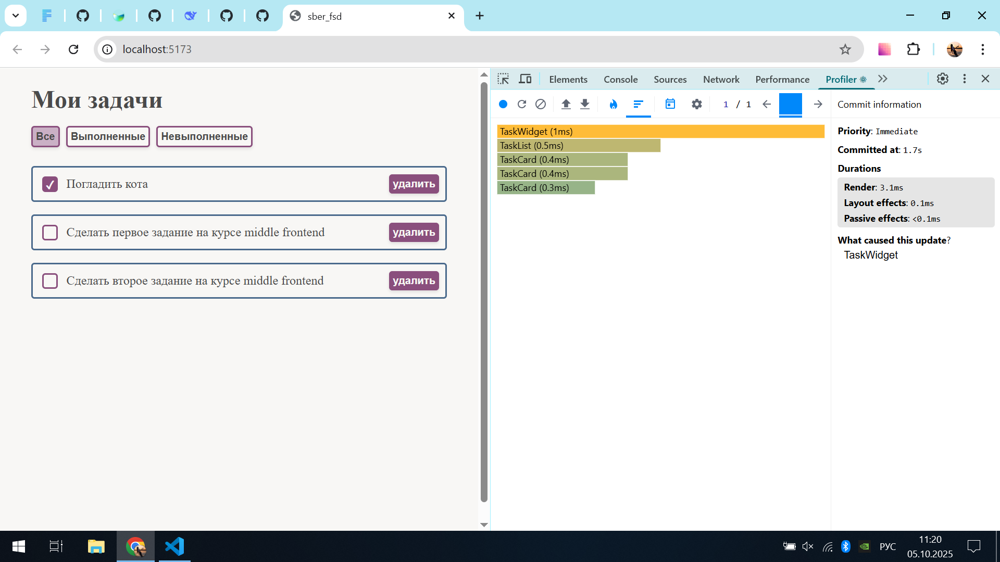
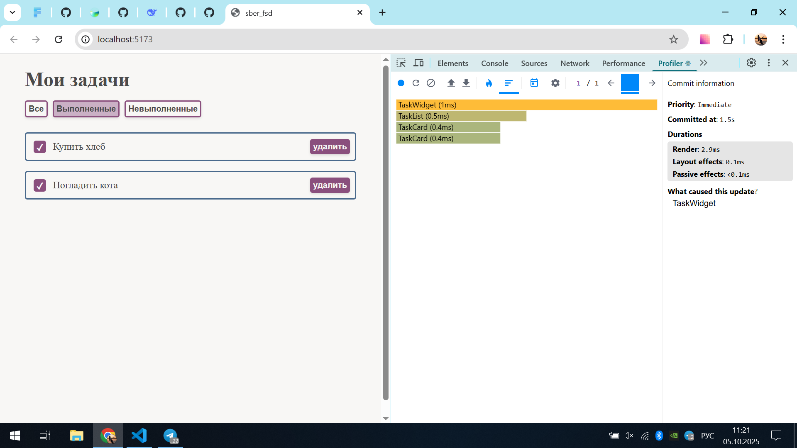
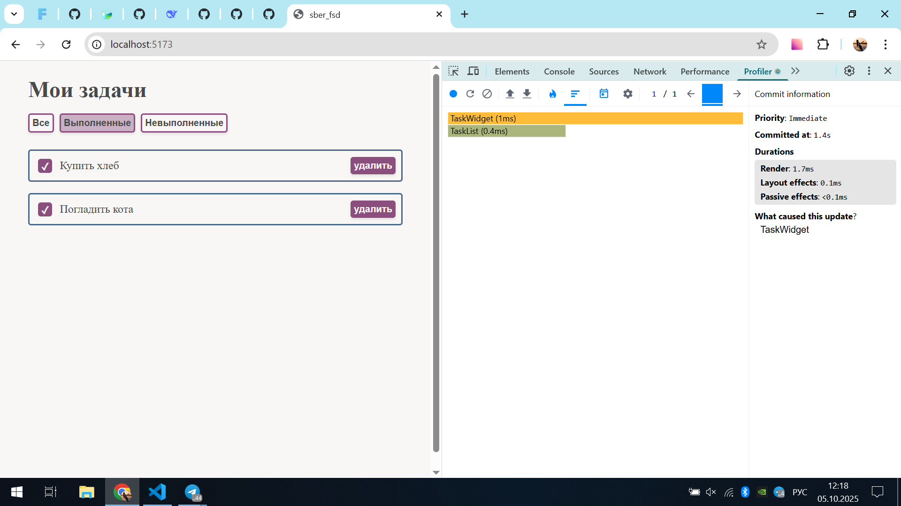

Было проведено профилирование проекта:

1. В момент действия удаления задачи:

- До мер по оптимизации при удалении одной задачи перерисовывались все остальные задачи:
  

- После оптимизации остальные задачи не перерисовываются:
  

2. В момент действия по фильтрации:

- До мер по оптимизации при переключении фильтра перерисовывались все задачи, в том числе те, которые не меняются в новом списке:
  

- После оптимизации задачи, которые должны остаться в списке и не меняются, не перерисовываются:
  
